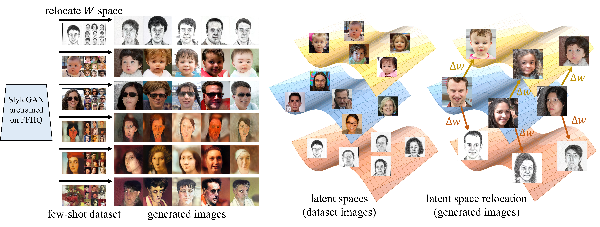

# WeditGAN ($w$-edit GAN)



This repository is the official implementation of the following paper:

> **WeditGAN: Few-Shot Image Generation via Latent Space Relocation**<br>
> [Yuxuan Duan](https://github.com/Ldhlwh), [Li Niu](http://www.ustcnewly.com/), [Yan Hong](https://github.com/hy-zpg), [Liqing Zhang](https://bcmi.sjtu.edu.cn/~zhangliqing/)<br>
> The 38th AAAI Conference on Artificial Intelligence (AAAI 2024)<br>
> https://arxiv.org/abs/2305.06671

## Getting Started

- :warning:This repository is based on the official NVIDIA implementaion of [StyleGAN2-ADA](https://github.com/NVlabs/stylegan2-ada-pytorch). Follow the [requirements](https://github.com/NVlabs/stylegan2-ada-pytorch#requirements) of it before the steps below. (Docker is not supported. Windows might probably do with minor modification, yet have not been tested.)
- Additional python libraries: ```pip install scipy psutil lpips tensorboard```.
- Clone the repository:
    ```shell
    git clone https://github.com/Ldhlwh/WeditGAN.git
    cd WeditGAN
    ```
    
## Dataset

- For your convenience, we provide the preprocessed target datasets (Sketches, Babies, Sunglasses, Amedeo, Raphael, Otto) used in the paper [here](https://drive.google.com/drive/folders/10CAKIJj6e5GavnSCcm2re2EsFOtruJ3m?usp=sharing). Please follow the licenses of the original datasets while using them.
- If you wish to try your own source/target datasets, put all the images into a single folder and run
    ```shell
    python dataset_tool.py --source /path/to/image/folder \
        --dest ./data/source_or_target_dataset.zip \
        --width 256 --height 256
    ```
    
## Stage 1: Pretraining

- You may skip this stage by downloading the pretrained model on FFHQ provided [here](https://drive.google.com/drive/folders/10CAKIJj6e5GavnSCcm2re2EsFOtruJ3m?usp=sharing).
- Pretrain a StyleGAN2 model on a source dataset, using the default configuration ```auto``` on four GPUs:
    ```shell
    python train.py --data ./data/source_dataset.zip \
        --outdir runs/source_dataset \
        --gpus 4 --kimg 25000
    ```
- Check the qualitative & quantitative results under ```./runs/source_dataset/*```. Choose a good model for the transfer in Stage 2. You may optionally make a copy as ```./pkls/source_dataset.pkl``` for easy loading.

## Stage 2: Transfer

- Transfer the pretrained model to a target dataset with latent space relocation (constant delta w):
    ```shell
    python train.py --data ./data/target_dataset.zip --metric-data ./data/target_dataset_full.zip \
        --outdir runs/target_dataset --resume pkls/source_dataset.pkl \
        --gpus 1 --kimg 400 --snap 10 --transfer constant_delta_w
    ```
- For variant of perpendicular regularization, add ```--reg perp --lambda-reg 0.0001```
- For variant of contrastive loss, add ```--cl gd_feat --lambda-cl 0.5```
- The above process will by default compute FID@5k, KID@5k and Intra-cluster LPIPS@1k on-the-fly per ```--snap``` ticks (*i.e.* $4 \times$```--snap``` kimgs). You may alter the metric list with ```--metrics```.
- :warning:You must specify ```--metric-data``` if you wish to compute FID/KID of the transferred model with a full set (e.g. Sketches/Babies/Sunglasses), otherwise you may omit this argument and the model will be evaluated using ```--data```. Note that Intra-cluster LPIPS will always be evaluated with the few-shot ```--data```, whether ```--metric-data``` is specified or not.
- Check the qualitative & quantitative results under ```./runs/target_dataset/*```. You may optionally make a copy of a good model as ```./pkls/target_dataset_cdw.pkl``` for easy loading.

## Stage 3: Editing Intensity Finetuning (optional as a variant)

- After $\Delta w$ is learned in Stage 2, finetune the editing intensity with $\alpha$-modules:
  ```shell
  python train.py --data ./data/target_dataset.zip --metric-data ./data/target_dataset_full.zip \
        --outdir runs/target_dataset --resume pkls/target_dataset.pkl \
        --gpus 1 --kimg 400 --snap 10 --transfer learn_alpha_cdw \
        --reg alpha_l2 --lambda-reg 0.1 --lrate 0.0005    # A smaller learning rate should be used
  ```
- :warning:You should use the model that has been transferred to the target domain with ```--resume```, rather than that pretrained on the source dataset.
  
## Inference

- Generate 20 random target images:
    ```shell
    python generate.py --network pkls/target_dataset_cdw.pkl \
        --output gen_img/target_dataset
        
    # You may also try different values for the following settings
    # --seeds: specify the random seeds to be used
    # --num: number of generated images (only when --seeds is unspecified)
    ```
- Or, if you just wish to have a glimpse of the performance of a model, run the following command:
    ```shell
    python generate.py --network runs/target_dataset/path/to/a/network-snapshot-<kimg>.pkl --cmp
    ```
     to generate samples of target dataset, source images and their corresponding target images and concatenate them under the same directory with ```model.pkl```, named ```cmp<kimg>.jpg```.
     
## Citation

If you find WeditGAN helpful to your research, please cite our paper:
```
@inproceedings{Duan2024WeditGAN,
  title     = {WeditGAN: Few-Shot Image Generation via Latent Space Relocation},
  author    = {Yuxuan Duan and Li Niu and Yan Hong and Liqing Zhang},
  booktitle = {AAAI},
  year      = {2024}
}
```

## Acknowledgements

- This work was supported by the Shanghai Municipal Science and Technology Major/Key Project, China (Grant No. 2021SHZDZX0102, Grant No. 20511100300) and the National Natural Science Foundation of China (Grant No. 62076162).
- This repository have used codes from [StyleGAN-ADA](https://github.com/NVlabs/stylegan2-ada-pytorch), [DFMGAN](https://github.com/Ldhlwh/DFMGAN) and [LPIPS](https://github.com/richzhang/PerceptualSimilarity).
